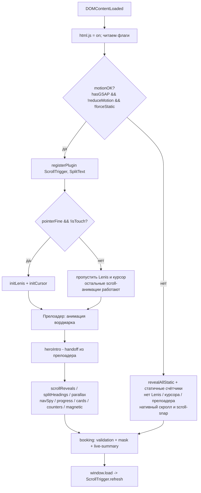
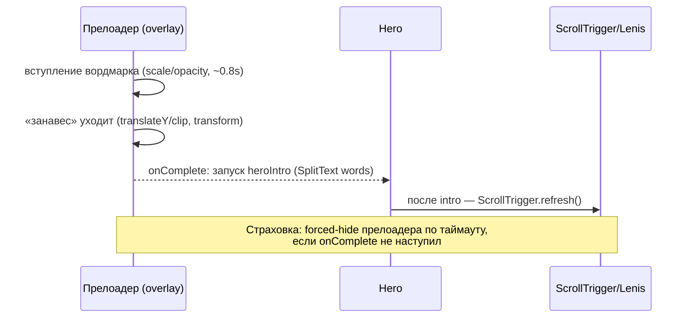

# feat: Statement-уровень анимации и интерактива для лендинга ЦЕХ 23

## Summary

Поднять одностраничник «ЦЕХ 23» с уровня «аккуратные микро-анимации» до **statement-уровня**: плавный скролл (Lenis), брендовый прелоадер, текст-ревилы через GSAP SplitText, параллакс-глубина hero и галереи, кастомный курсор, pointer-реактивные карточки, навигация со scroll-spy и индикатором прогресса, а также «умная» форма записи (маска телефона + живая сводка заявки) и амбиентные контролы (кнопка «наверх», липкий CTA на мобиле).

Жёсткое ограничение, которое **не меняется**: прогрессивная деградация и перф-инварианты. Без JS, при `prefers-reduced-motion` или с `?static=1` страница остаётся полностью читаемой и статичной; анимируем только `transform`/`opacity`; нативных `scroll`-слушателей не добавляем (позиция скролла — только через ScrollTrigger, а Lenis подключается через собственный `lenis.on('scroll', …)` + общий `gsap.ticker`). Тяжёлые desktop-фичи (курсор, плавный скролл) гасятся на touch/узких экранах.

Сборки по-прежнему нет — всё подключается через CDN и живёт в трёх файлах (`index.html`, `assets/css/styles.css`, `assets/js/main.js`), `main.js` остаётся одной IIFE.

---

## Problem Frame

Страница уже технически опрятна (GSAP + ScrollTrigger, hero-stagger, scroll-reveal, пин-галерея, счётчики, магнитные кнопки), но ощущается «сдержанно-стандартной». Запрос — сделать её **заметнее и интерактивнее**, на statement-уровне, не потеряв читаемость и производительность.

Риск задачи не в технической новизне отдельных приёмов, а в том, чтобы:
1. навесить богатый слой движения, **не сломав** существующий контракт деградации (упавший JS / RM / `?static` / отсутствие GSAP);
2. корректно поженить Lenis со ScrollTrigger (один источник RAF), иначе появится джиттер пина и текст-ревилов;
3. не превратить «statement» в «гиммик» — каждое движение должно читаться как намеренное, а не как шум.

---

## Requirements

| ID | Требование |
|----|------------|
| R1 | Плавный скролл (Lenis) на desktop с pointer:fine; синхронизация со ScrollTrigger через единый тикер; полный откат на нативный скролл при RM/touch/`?static`/отсутствии GSAP. |
| R2 | Брендовый прелоадер (анимация вордмарка «ЦЕХ 23» → передача в hero-intro). Никогда не блокирует контент при сбое JS; по умолчанию (без JS) оверлея нет. |
| R3 | Текст-ревилы заголовков секций и hero через GSAP SplitText (строки/слова), запускаемые по входу в вьюпорт. |
| R4 | Параллакс-глубина: фон hero и изображения галереи «Атмосфера» двигаются с разной скоростью относительно скролла (только `transform`). |
| R5 | Кастомный курсор (точка + кольцо) с hover-состояниями над интерактивными и фото-элементами; полностью отключён на touch и при RM. |
| R6 | Pointer-реактивные карточки: tilt/parallax услуг (bento), раскрытие детали у карточек мастеров, контр-движение фото галереи. |
| R7 | Навигация: scroll-spy с активным состоянием пунктов меню + индикатор прогресса чтения; сохранить текущее уплотнение навбара. |
| R8 | «Умная» форма: маска ввода телефона и живая сводка заявки (услуга + мастер + цена) с пересчётом в реальном времени. Текущая валидация и состояние успеха сохраняются. |
| R9 | Амбиентные контролы: кнопка «наверх» (появляется по прогрессу) и липкий CTA «Записаться» на мобиле. |
| R10 | Все новые анимации проходят матрицу деградации: no-JS, `prefers-reduced-motion`, `?static=1`, touch, узкий вьюпорт (<768px) — без визуальных артефактов и без потери читаемости/контента. |

---

## Key Technical Decisions

**KTD1 — Lenis как слой плавного скролла, синхронизированный через `gsap.ticker`.**
Инициализируем Lenis, подписываем `lenis.on('scroll', ScrollTrigger.update)`, гоним RAF Lenis из общего тикера GSAP (`gsap.ticker.add(t => lenis.raf(t * 1000))`) и `gsap.ticker.lagSmoothing(0)`. Это убирает рассинхрон двух RAF-циклов (главная причина «дёрганого» пина) и не вводит нативных `scroll`-слушателей — инвариант CLAUDE.md соблюдён по духу и по букве. Lenis включается **только** когда `hasGSAP && !reduceMotion && !forceStatic && pointer:fine`; иначе — нативный скролл.

**KTD2 — поднять GSAP 3.12.5 → 3.13.x (cdnjs) и подключить бесплатный SplitText.**
SplitText стал бесплатным; cdnjs раздаёт его с 3.13.0. Берём `gsap`, `ScrollTrigger`, `SplitText` одной версией с того же cdnjs, что уже используется. SplitText заменяет ручную разбивку hero на `` и даёт строчные/словесные ревилы заголовков. Деградация: если SplitText не загрузился — заголовки видимы как обычный текст (revealAllStatic).

**KTD3 — единый «boot-гейт» деградации.**
Расширяем существующую развилку (`reduceMotion`, `hasGSAP`, `forceStatic`) одним вычисляемым `motionOK` + отдельным `pointerFine`/`isTouch`. Все statement-фичи (Lenis, курсор, прелоадер, параллакс, tilt) висят за этими флагами в одном месте — чтобы добавление фичи не размывало контракт деградации. CSS по умолчанию рисует страницу в «конечном» состоянии; скрытие/оверлеи включает только `html.js`.

**KTD4 — прелоадер как прогрессивное усиление, а не зависимость.**
Оверлей прелоадера добавляется в разметку, но по умолчанию (CSS без `html.js` или при RM/`?static`) либо отсутствует, либо мгновенно скрыт — контент никогда не оказывается за ним при сбое JS. Таймаут-страховка принудительно снимает оверлей, даже если что-то пошло не так.

**KTD5 — остаёмся в трёх файлах и одной IIFE.**
Никаких модулей/сборки (инвариант архитектуры). Новый интерактив — новые функции внутри той же IIFE `main.js`; новые кейфреймы/стартовые состояния — в `styles.css`; новые токены (если появятся) — в инлайн `tailwind.config`. Любой кастом-курсор/прелоадер/прогресс-бар — это `transform`/`opacity`-слои с `position: fixed`, как `.grain`.

**KTD6 — pointer-реактивность через `gsap.quickTo`, не через ручной rAF.**
Tilt карточек и кастом-курсор используют `gsap.quickTo`/`gsap.ticker` (как уже сделано в `setupMagnetic`), без собственных `requestAnimationFrame`-циклов и без layout-thrash. Слушаем `pointermove` на элементах, пишем только в `transform`.

---

## High-Level Technical Design

### Boot-последовательность и гейт деградации

### Прелоадер → hero handoff (sequence)

Диаграммы — авторитетная директива по форме оркестрации, не «набросок».

---

## Implementation Units

Порядок — по зависимостям. U1 (фундамент) обязателен первым; U2–U8 опираются на boot-гейт и тикер-синхронизацию из U1.

> Тестового раннера в проекте нет («Тестов/линтеров нет»). Поэтому «Test scenarios» — это конкретные **сценарии ручной проверки** (вход → действие → ожидаемое), включая обязательную матрицу деградации. Каждая фича-несущая единица проходит матрицу: no-JS, RM, `?static=1`, touch, узкий вьюпорт.

### U1. Фундамент: Lenis + бамп GSAP 3.13 + boot-гейт

**Goal:** Подключить плавный скролл и единый тикер, поднять GSAP до 3.13.x с SplitText, централизовать флаги деградации (`motionOK`, `pointerFine`, `isTouch`).
**Requirements:** R1, R2 (инфраструктура), R10; реализует KTD1, KTD2, KTD3.
**Dependencies:** нет.
**Files:**
- `index.html` — обновить CDN-теги GSAP/ScrollTrigger до 3.13.x, добавить `SplitText.min.js` и Lenis (`lenis@1` JS + CSS) перед `main.js`.
- `assets/js/main.js` — ввести `motionOK`/`pointerFine`/`isTouch`, функцию `initLenis()`, регистрацию `SplitText`, расширить блок `ready()`.
- `assets/css/styles.css` — рекомендуемые Lenis-классы (`html.lenis, html.lenis body { height: auto }`, `.lenis.lenis-smooth { scroll-behavior: auto !important }`) под `html.js`.
**Approach:** `initLenis()` создаёт Lenis, `lenis.on('scroll', ScrollTrigger.update)`, `gsap.ticker.add(t => lenis.raf(t*1000))`, `gsap.ticker.lagSmoothing(0)`. Вызывается только при `motionOK && pointerFine && !isTouch`. Якорные ссылки навигации перевести на `lenis.scrollTo(target)` (с fallback на нативный переход, когда Lenis выключен). Существующие `horizontalPan`/`navCondense`/`scrollReveals` не трогаем — они продолжают читать позицию через ScrollTrigger, который теперь обновляется из Lenis.
**Patterns to follow:** существующая развилка в `ready()` (`main.js:189`), `setupMagnetic` как пример `gsap.quickTo`.
**Test scenarios:**
- Desktop, мышь: скролл плавный; пин «Атмосферы» и счётчики срабатывают без джиттера и рассинхрона.
- `?static=1`: Lenis не инициализируется, нативный скролл, контент сразу видим.
- RM включён: нативный скролл, `scroll-snap` работает, никаких трансформов.
- Touch-устройство / <768px: Lenis выключен, нативный скролл/scroll-snap «Атмосферы».
- GSAP заблокирован (эмуляция): `revealAllStatic`, страница читаема, без ошибок в консоли.
- Якорь «Услуги» из навбара: при Lenis — плавная прокрутка к секции; без Lenis — обычный jump.

### U2. Брендовый прелоадер с передачей в hero

**Goal:** Короткая брендовая заставка (вордмарк «ЦЕХ23» — scale/opacity + уход «занавеса»), по завершении запускающая `heroIntro`.
**Requirements:** R2, R10; реализует KTD4.
**Dependencies:** U1.
**Files:**
- `index.html` — `
` сразу после `.grain`, с вордмарком.
- `assets/css/styles.css` — стили оверлея (`position: fixed`, поверх контента) **только** под `html.js`; дефолт без `html.js` и при RM/`?static` — оверлея нет/мгновенно скрыт.
- `assets/js/main.js` — `runPreloader(onDone)`; `heroIntro` вызывается из `onDone` (или сразу, если прелоадер пропущен).
**Approach:** Только `transform`/`opacity`. Timeline GSAP: появление вордмарка → уход занавеса (`yPercent`/`clip-path` через transform-слой) → `onComplete` снимает оверлей (`display:none`/`pointer-events:none`) и зовёт `heroIntro`. Страховка: `setTimeout` форс-скрывает оверлей (~2.5s), если `onComplete` не наступил. При `!motionOK` — оверлей не показывается вообще, `heroIntro` пропускается, контент статичен.
**Patterns to follow:** `.grain` как fixed-слой; таймлайн в `heroIntro` (`main.js:67`).
**Test scenarios:**
- Свежая загрузка desktop: вижу анимацию вордмарка → занавес уходит → hero уже анимируется; оверлей удалён, скролл доступен.
- JS отключён: оверлея нет, hero и весь контент видимы сразу.
- RM / `?static=1`: прелоадер не появляется.
- Эмуляция «зависшего» onComplete: через ~2.5s оверлей всё равно снят, страница доступна.
- A11y: оверлей `aria-hidden`, фокус не залипает за ним.

### U3. SplitText-ревилы hero и заголовков секций

**Goal:** Заменить ручные `.hero-word` на SplitText и добавить строчные/словесные ревилы у `<h2>` секций по входу во вьюпорт.
**Requirements:** R3, R10; реализует KTD2.
**Dependencies:** U1 (SplitText зарегистрирован), U2 (hero-intro handoff).
**Files:**
- `index.html` — у hero `<h1>` убрать ручные ``, оставить чистый текст (+ ` `); пометить целевые `<h2>` атрибутом (напр. `data-split`).
- `assets/js/main.js` — `splitHeadings()`: `new SplitText(el, { type: 'lines,words' })`, анимация по `ScrollTrigger.batch`/`onEnter`; hero — из таймлайна intro.
- `assets/css/styles.css` — стартовые состояния под `html.js` для split-целей (`overflow: hidden` у строк-обёрток при необходимости).
**Approach:** SplitText строит обёртки строк/слов; анимируем `yPercent`/`opacity` со stagger. Обязательно `revert()` или повторный сплит на `ScrollTrigger`-refresh/resize, чтобы переносы строк пересчитывались (иначе при ресайзе строки «рвутся»). Деградация: при `!motionOK` или отсутствии SplitText — текст остаётся обычным (revealAllStatic покрывает), сплит не выполняется.
**Patterns to follow:** `scrollReveals` (`main.js:75`) для batch-входа; `revealAllStatic` исключения.
**Test scenarios:**
- Hero `<h1>`: слова всплывают со stagger после прелоадера.
- `<h2>` «Что мы делаем»/«Команда цеха»/…: строки появляются при входе в вьюпорт, один раз.
- Ресайз окна / смена ориентации: строки переразбиваются без визуального разрыва.
- RM / no-JS / `?static`: заголовки — обычный читаемый текст, без скрытия.
- Узкий вьюпорт: переносы корректны, нет обрезанного текста.

### U4. Параллакс-глубина hero и галереи «Атмосфера»

**Goal:** Фон hero и фигуры галереи двигаются с разной скоростью относительно скролла, добавляя глубину.
**Requirements:** R4, R6 (галерея), R10.
**Dependencies:** U1.
**Files:**
- `index.html` — целевые элементы пометить (`data-parallax`, опц. `data-parallax-speed`); фон hero и `.pan-item img`.
- `assets/js/main.js` — `setupParallax()`: ScrollTrigger со `scrub`, `y`/`xPercent` в зависимости от скорости.
**Approach:** Только `transform`. Hero-фон: лёгкий `y`-сдвиг при выходе секции. Внутри пин-галереи — контр-движение картинок относительно трека (тонкий `xPercent` на `.pan-item img`), не ломая горизонтальный пан из `horizontalPan`. Все триггеры `invalidateOnRefresh: true`. На <768px/RM — параллакс выключен (нативный scroll-snap галереи сохраняется).
**Patterns to follow:** `horizontalPan` (`main.js:107`) — scrub/`invalidateOnRefresh`.
**Test scenarios:**
- Desktop: при скролле фон hero «отстаёт», создавая глубину; нет разрывов краёв (достаточный overscan/scale фона).
- Галерея: картинки внутри пина мягко контр-движутся, пан остаётся плавным.
- RM / touch / <768px: параллакса нет, галерея скроллится нативным snap.
- Перф: в DevTools — только composite-слои (`transform`), без layout/paint штормов.

### U5. Кастомный курсор

**Goal:** Statement-курсор (точка + следящее кольцо) с hover-состояниями над ссылками/кнопками/фото; только desktop/pointer:fine.
**Requirements:** R5, R10; реализует KTD6.
**Dependencies:** U1.
**Files:**
- `index.html` — `
` + `
` (fixed, `aria-hidden`).
- `assets/css/styles.css` — стили курсора под `html.js`; на интерактиве `cursor: none` только при активном кастом-курсоре; дефолт — системный курсор.
- `assets/js/main.js` — `initCursor()`: `pointermove` + `gsap.quickTo` для точки (быстро) и кольца (с лагом); классы hover при наведении на `a, button, [data-magnetic], .group` (фото).
**Approach:** Точка следует мгновенно, кольцо — с инерцией (`quickTo`, разные `duration`). Над интерактивом — увеличение кольца/смена цвета на `ember`. Запускается только при `motionOK && pointerFine && !isTouch`; иначе элементы не вставляются/скрыты и системный курсор не подменяется. Совместимость с `setupMagnetic` (оба читают `pointermove`, пишут разные `transform`).
**Patterns to follow:** `setupMagnetic` (`main.js:46`) — `quickTo`-подход.
**Test scenarios:**
- Desktop/мышь: точка и кольцо следуют, кольцо с инерцией; над кнопкой «Записаться» — hover-состояние.
- Touch: кастом-курсор отсутствует, системное поведение не тронуто (тапы работают).
- RM / `?static`: курсор не инициализируется.
- Клавиатурная навигация: `:focus-visible` обводка по-прежнему видна, курсор не мешает фокусу.

### U6. Pointer-реактивные карточки и раскрытие мастеров

**Goal:** Tilt/parallax bento-услуг по положению курсора, раскрытие доп-детали у карточек мастеров на hover, лёгкое оживление отзывов.
**Requirements:** R6, R10; реализует KTD6.
**Dependencies:** U1 (U5 желателен, но не обязателен).
**Files:**
- `index.html` — карточкам услуг добавить hook (`data-tilt`); карточкам мастеров — скрытый блок детали (специализация/слот «к записи»).
- `assets/js/main.js` — `setupTilt()` (rotateX/rotateY по позиции курсора, возврат на `pointerleave`), `setupMasterReveal()` (раскрытие через `transform`/`opacity`).
- `assets/css/styles.css` — `transform-style: preserve-3d`/перспектива на контейнерах tilt; стартовые состояния детали мастеров под `html.js`.
**Approach:** Tilt — `gsap.quickTo` на `rotationX/rotationY` + лёгкий `scale`; clamp угла (~6–8°). Деталь мастера: по умолчанию (без `html.js`) видна/в потоке, чтобы при no-JS инфо не терялась; при активном JS — стартово свёрнута и раскрывается на hover/focus. Всё через `transform`/`opacity`. На touch tilt отключён, раскрытие — по тапу/`:focus-within`.
**Patterns to follow:** hover-zoom фото (`group-hover:scale-105` в `index.html`), `setupMagnetic`.
**Test scenarios:**
- Услуги (desktop): карточка наклоняется к курсору, плавно возвращается; текст читаем, без дрожания.
- Мастера: на hover/focus появляется доп-деталь; на touch — по тапу; при no-JS деталь видна сразу.
- RM / `?static`: tilt отключён, карточки статичны.
- Перф: только composite-`transform`.

### U7. Навигация: scroll-spy + индикатор прогресса

**Goal:** Подсветка активного пункта меню по текущей секции и тонкий индикатор прогресса чтения; сохранить уплотнение навбара.
**Requirements:** R7, R10.
**Dependencies:** U1.
**Files:**
- `index.html` — прогресс-бар (`
`, fixed) и, при необходимости, `data`-связки пунктов меню с секциями.
- `assets/js/main.js` — `setupNavSpy()` (ScrollTrigger на секциях → toggle активного класса у соответствующей ссылки), `setupProgress()` (ScrollTrigger на `body`/документе → `scaleX` бара).
- `assets/css/styles.css` — стиль прогресс-бара и активного пункта (`text-bone`/подчёркивание `ember`).
**Approach:** Каждой секции (`#services`, `#masters`, `#atmosphere`, `#reviews`, `#booking`) — ScrollTrigger, в `onToggle` помечаем активную ссылку. Прогресс — `scaleX` от 0 до 1 через scrub. Никаких `scroll`-листенеров — всё на ScrollTrigger. Существующий `navCondense` остаётся.
**Patterns to follow:** `navCondense` (`main.js:91`) — `ScrollTrigger.create`/`onUpdate`.
**Test scenarios:**
- Скролл по секциям: активный пункт меню переключается синхронно; на границах нет «мигания».
- Прогресс-бар растёт от 0 до 100% к футеру.
- Клик по пункту: плавный (Lenis) переход, активный класс корректен по прибытии.
- RM / no-JS: бар скрыт/нейтрален, меню кликабельно, контент не страдает.

### U8. «Умная» форма записи + амбиентные контролы

**Goal:** Маска телефона, живая сводка заявки (услуга + мастер + цена) и амбиентные контролы: кнопка «наверх» и липкий CTA на мобиле.
**Requirements:** R8, R9, R10.
**Dependencies:** U1.
**Files:**
- `index.html` — блок-сводка рядом с формой (услуга, мастер, итоговая цена); `data`-атрибуты цен на `<option>` услуг; кнопка «наверх»; мобильный sticky-CTA.
- `assets/js/main.js` — расширить `bookingForm()`: `maskPhone()` (формат `+7 (___) ___-__-__`), `liveSummary()` (слушает `change` select-ов, обновляет сводку и цену); `setupBackToTop()` (видимость по прогрессу, клик → `lenis.scrollTo(0)`/нативно), `setupStickyCTA()`.
- `assets/css/styles.css` — стили сводки, кнопки «наверх» (появление через `opacity`/`transform`), мобильного CTA; всё уважает RM.
**Approach:** Маска — на `input` поля `tel`, нормализуем цифры, форматируем (текущая валидация «≥10 цифр» сохраняется, `main.js:153`). Сводка читает выбранные `service`/`master` и цену из `data`-атрибута, пересчитывает мгновенно (детская — пометка «до 12 лет» уже есть). Цены берём из существующего прайса в разметке услуг, чтобы не плодить второй источник истины. Кнопка «наверх»/CTA — `transform`/`opacity`, появление по `ScrollTrigger`/прогрессу. Точка интеграции YClients остаётся `TODO` (бэкенд вне охвата).
**Patterns to follow:** `bookingForm` (`main.js:133`) — слушатели/состояния; кнопки `data-magnetic`.
**Test scenarios:**
- Ввод телефона: символы форматируются в маску; «+7 999 1234567» → корректный вид; валидация и сабмит работают как раньше.
- Смена услуги/мастера: сводка и цена обновляются мгновенно и совпадают с прайсом в карточках.
- Сабмит валидной формы: прежнее состояние успеха (`#form-success`) и сброс полей сохранены.
- Кнопка «наверх»: появляется после прокрутки, возвращает наверх (плавно при Lenis, нативно иначе).
- Мобильный sticky-CTA: виден на <768px, ведёт к `#booking`, не перекрывает контент/футер критично.
- RM / no-JS: маска не ломает ручной ввод; сводка либо статична, либо отсутствует без вреда; форма остаётся отправляемой/читаемой.

---

## Scope Boundaries

**В охвате:** statement-слой движения и интерактива поверх существующего GSAP-фундамента (U1–U8), с сохранением контракта деградации и перф-инвариантов.

### Отложено в follow-up
- Self-host шрифтов и компиляция Tailwind вместо play-CDN (упомянуто в CLAUDE.md как «в проде»). Не нужно для текущей задачи, но усилит перф.
- Локализация фото в `assets/img/` вместо удалённых Unsplash-URL (есть `setupImageFallback`).
- Подключение реального виджета YClients (точка помечена `TODO`).

### Вне продукта (non-goals)
- Бэкенд/реальная отправка заявок.
- Редизайн вёрстки, смена брендовой палитры/типографики, новый контент/секции.
- Звук, видео-фоны, тяжёлые WebGL/canvas-эффекты (риск перфа и гиммика — против духа «намеренного» движения).

---

## Risks & Mitigations

| Риск | Митигация |
|------|-----------|
| Lenis рассинхронизируется со ScrollTrigger → джиттер пина/ревилов. | Единый `gsap.ticker` + `lagSmoothing(0)` + `invalidateOnRefresh` (KTD1); QA-сценарий пина в U1. |
| Прелоадер прячет контент при сбое JS. | Оверлей только под `html.js`; таймаут-страховка форс-скрытия (KTD4, U2). |
| SplitText «рвёт» строки при ресайзе. | `revert()`/повторный сплит на refresh/resize (U3). |
| Кастом-курсор/смуз-скролл ухудшают мобайл/доступность. | Гейт `pointerFine && !isTouch`; `:focus-visible` сохранён; полное отключение при RM (KTD3, U5). |
| «Statement» скатывается в гиммик/перегруз. | Только `transform`/`opacity`, clamp амплитуд, единый гейт; non-goal на WebGL/звук. |
| Бамп GSAP 3.13 ломает текущие анимации. | Минорный апгрейд в пределах v3; smoke-проверка hero/пина/счётчиков после бампа (U1). |
| Два источника цен (карточки vs сводка) расходятся. | Цена в сводке читается из `data`-атрибутов, привязанных к прайсу карточек (U8). |

---

## Alternatives Considered

- **Без Lenis, только нативный скролл + ScrollTrigger.** Дешевле и без зависимости, но «плавность» — половина ощущения statement; отвергнуто, т.к. пользователь выбрал statement-уровень. (Lenis всё равно gated — деградация остаётся на нативный скролл.)
- **Свободная замена SplitText (ручной сплит по символам).** Раньше имело смысл из-за пейвола; теперь SplitText бесплатен и надёжнее обрабатывает строки/ресайз — берём официальный (KTD2).
- **Модуляризация `main.js` под statement-объём.** Чище по коду, но ломает инвариант «без сборки, одна IIFE» и вводит трение; отвергнуто — расширяем существующую IIFE (KTD5).
- **WebGL/canvas-эффекты (шейдерный hero, частицы).** Максимальный «вау», но перф-риск, тяжесть и риск гиммика на лендинге барбершопа; вынесено в non-goals.

---

## Open Questions

- **OQ1 (execution-time):** финальные тайминги/амплитуды прелоадера и параллакса подбираются «на глаз» при реализации — план задаёт диапазоны, не точные значения.
- **OQ2:** нужен ли scroll-spy/прогресс-бар на мобиле, или это desktop-only деталь? По умолчанию — прогресс-бар везде, scroll-spy в меню только где меню видно (`lg:flex`).
- **OQ3:** показывать ли мобильный sticky-CTA на всех секциях или прятать над `#booking`/футером, чтобы не дублировать. Дефолт — прятать у формы и футера.

---

## Sources & Research

- GSAP теперь полностью бесплатен, включая SplitText (Webflow, апрель 2025); cdnjs раздаёт `SplitText.min.js` с 3.13.0 — основание для бампа 3.12.5 → 3.13.x. [GSAP SplitText Docs](https://gsap.com/docs/v3/Plugins/SplitText/), [GSAP on cdnjs](https://cdnjs.com/libraries/gsap), [Codrops: free GSAP plugins](https://tympanus.net/codrops/2025/05/14/from-splittext-to-morphsvg-5-creative-demos-using-free-gsap-plugins/)
- Канон синхронизации Lenis ↔ ScrollTrigger (единый `gsap.ticker`, `lagSmoothing(0)`, `lenis.on('scroll', ScrollTrigger.update)`). [Lenis (darkroomengineering)](https://github.com/darkroomengineering/lenis), [Next.js + Lenis + GSAP guide](https://devdreaming.com/blogs/nextjs-smooth-scrolling-with-lenis-gsap)
- Внутренние инварианты проекта (деградация, только `transform`/`opacity`, без `scroll`-листенеров, одна IIFE, CDN без сборки) — `CLAUDE.md`, `assets/js/main.js`, `assets/css/styles.css`.
